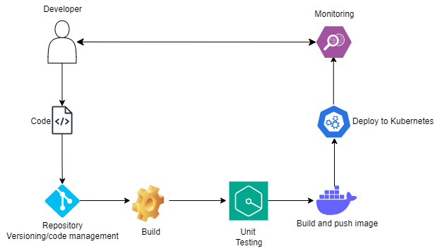

<h2>A DevOps Workflow</h2>

Plan: The developer(s) plans the project, and prioritizes work items, before implementation and deployment.

Code: Developers integrate their codes into a repository allowing collaboration and versioning. For every commit, a CI tool like Jenkins triggers a CI pipeline that automatically builds and tests the code changes.

Build: The source code is fetched from a version control system like Git and compiled/built and packaged into deployable artifacts. These artifacts could include executable binaries, libraries, configuration files, or other resources needed to deploy the application. Gradle, Maven

Testing: Individual units or components of code are tested in isolation to verify their functionality and behavior.

Deployment: After unit tests have passed successfully, the next step is to build a Docker image from a Docker file, containing the application code, dependencies, and configurations. The docker image is stored in a registry like Docker Hub or AWS ECR, making it available for deployment to any environment that has access to the registry.
Once the Docker image is pushed to the Docker registry, the CD pipeline triggers a deployment to Kubernetes. Kubernetes uses manifest files to create deployments to the target environment (staging, or production).

Monitoring: The monitoring stage in the DevOps process is crucial for observing and analyzing the performance, health, and behavior of the deployed application and infrastructure. This stage involves collecting, aggregating, and analyzing various metrics and logs to gain insights into the system's operation, identify issues, and make informed decisions for optimization and troubleshooting. 
